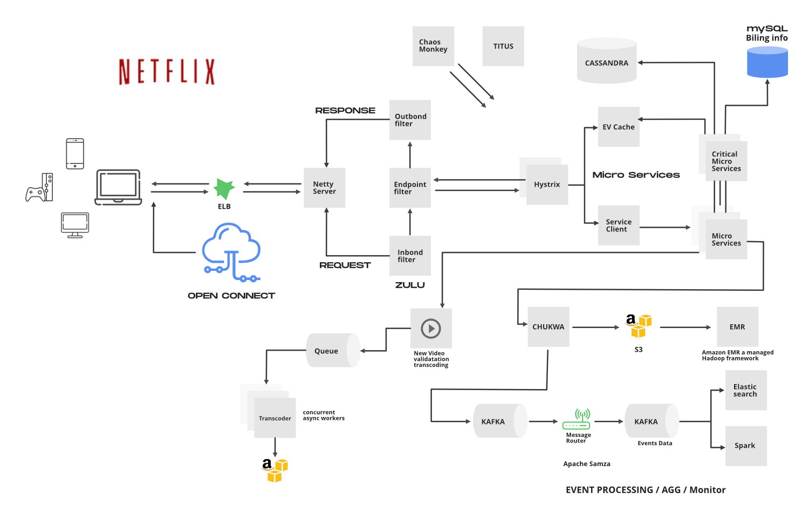

# 넷플릭스의 시스템

영상에 대한 내용

1. open connect를 사용하고, 오픈 커넥트는 주기적으로 자신의 상태를 넷플 서버에 보냄
2. 사용자가 비디오 시청을 누르면 요청이 넷플 서버로 간다
3. 넷플 서버는 사용자의 region에 있는 open connect의 비디오 파일 url을 전송
4. 사용자는 open connect의 url을 통해 비디오 시청함

### API 게이트웨이 Zuul

1. 로드밸런서로 요청이 들어옴
2. zuul 게이트 웨이로 요청 전달

zuul은 메인 서버와 각기 다른 서버로 구성되어 사용자 요청의 최전선에 위치하게 된다.

사용자의 요청에 따라서 필요한 곳에 zuul이 api를 전달하고 처리를 하게 된다.

### Hystrix

히스트릭스는 여러 서비스가 있다고 했을 때 요청받은 api 요청을 장애가 난 서비스에 보내지 않도록 서킷 브레이커 역할을 한다. 실시간으로 각 서비스의 상태를 체크하고, API 호출과 응답 지연 시간 등으로 장애 유무를 판단하고 해당 서비스를 격리 조치함.

상태체크를 통해서 서비스가 돌아오면 다시 요청을 보낼수 있다!